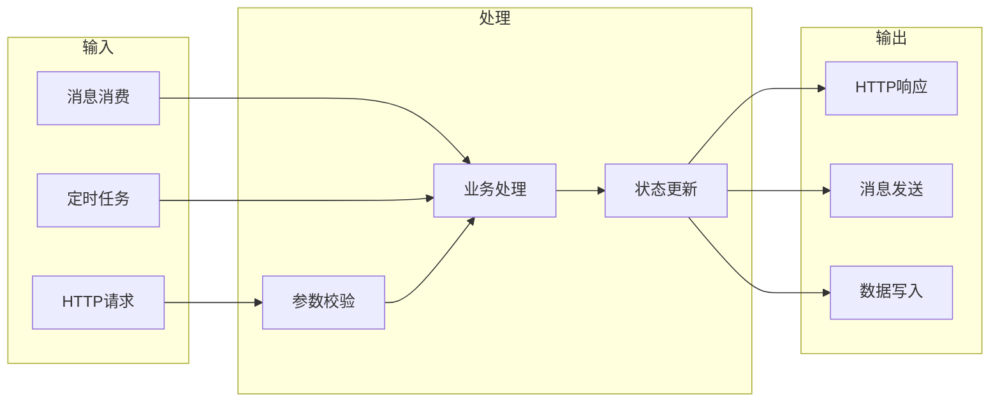
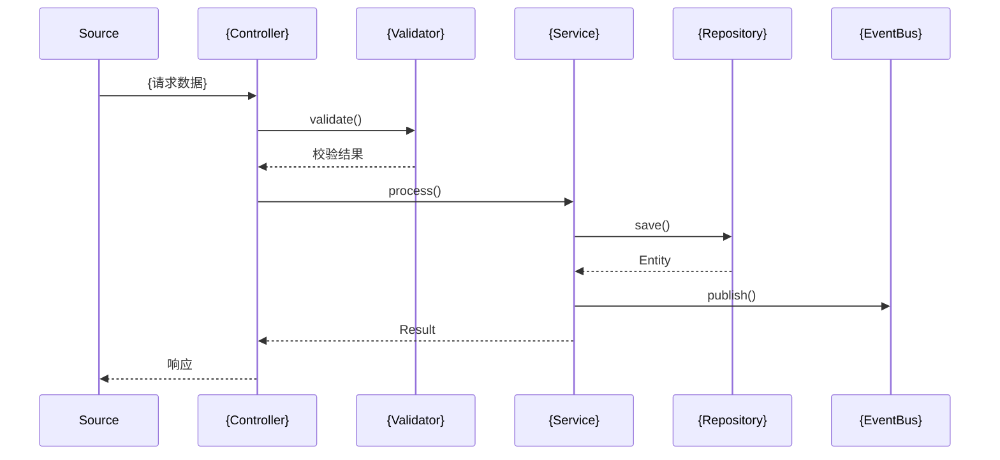

# {模块} 数据流

## 1. 概述

{数据流的整体描述，数据从哪里产生，经过哪里，最终到哪里}

---

## 2. 完整数据流图

---

## 3. 详细数据流

### 3.1 {场景A} 数据流

**触发条件**: {描述}

**数据转换**:

| 阶段 | 数据类型 | 转换 | 代码位置 |
|------|----------|------|----------|
| 输入 | RequestDTO | - | `{Controller}` |
| 校验 | RequestDTO | 字段校验 | `{Validator}` |
| 处理 | Entity | DTO→Entity | `{Service}` |
| 存储 | Entity | 持久化 | `{Repository}` |
| 输出 | ResponseDTO | Entity→DTO | `{Service}` |

---

## 4. 数据存储映射

| 数据对象 | 存储类型 | 存储位置 | 键/表 |
|----------|----------|----------|-------|
| {EntityA} | MySQL | 主库 | `{t_entity_a}` |
| {CacheData} | Redis | 集群 | `{cache:key}` |
| {Event} | Kafka | 集群 | `{topic}` |

---

## 5. 可检索关键词

`{数据对象}` / `{表名}` / `{Topic}` / `{CacheKey}` / `{转换类}`

---

## 6. 导航

- ↑ 上级: [深度主题索引](00-index.md)
- ← 相关: [{模块}](../02-modules/mod-{模块}.md)
