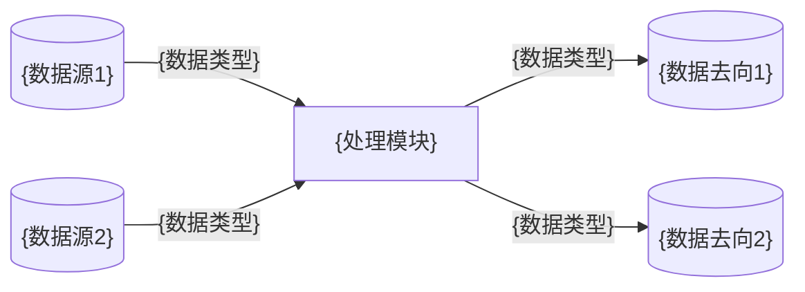
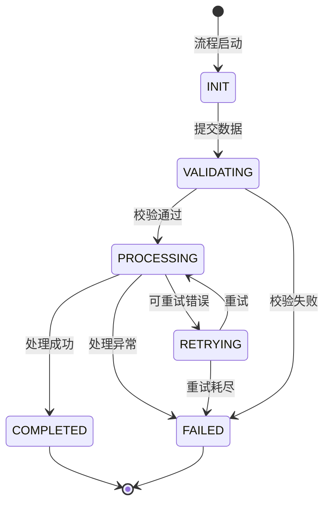
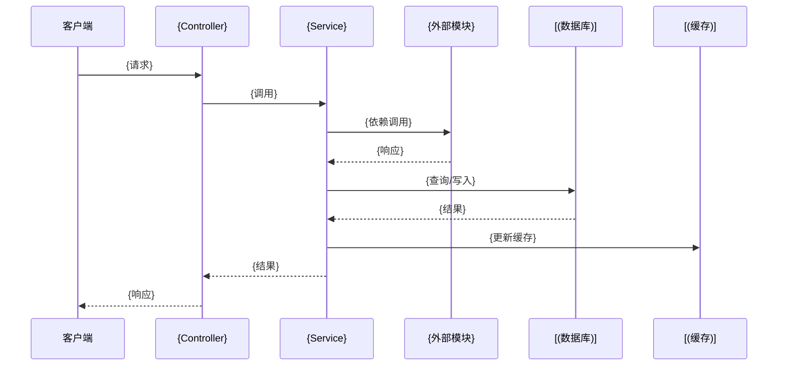

# {业务流程} 业务执行流程

> 所属模块: [{模块名}](../02-modules/mod-{模块名}.md)
> 一句话定位: {描述这个业务流程解决什么问题}

---

## 1. 业务执行流程

### 1.1 流程概述

{描述该业务流程的整体目标，涉及哪些角色/系统，最终产出什么结果}

### 1.2 详细步骤

| 步骤 | 动作 | 执行方 | 输入 | 输出 | 关键决策点 |
|------|------|--------|------|------|-----------|
| 1 | {动作描述} | {角色/模块} | {输入数据} | {输出数据} | {判断条件} |
| 2 | {动作描述} | {角色/模块} | {输入数据} | {输出数据} | {判断条件} |
| 3 | {动作描述} | {角色/模块} | {输入数据} | {输出数据} | {判断条件} |

### 1.3 业务流程图

```mermaid
flowchart TD
    subgraph Input["输入阶段"]
        I1[("{输入源1}")]
        I2[("{输入源2}")]
    end

    subgraph Process["处理阶段"]
        P1["{步骤1}"]
        P2{"{决策点}"}
        P3["{步骤2}"]
        P4["{步骤3}"]
    end

    subgraph Output["输出阶段"]
        O1[("{输出1}")]
        O2[("{输出2}")]
    end

    I1 --> P1
    I2 --> P1
    P1 --> P2
    P2 -->|{条件A}| P3
    P2 -->|{条件B}| P4
    P3 --> O1
    P4 --> O2
```

### 1.4 步骤间影响关系

- **步骤1 → 步骤2**: {描述步骤1的结果如何影响步骤2的执行}
- **步骤2 → 步骤3**: {描述步骤2的结果如何影响步骤3的执行}
- **决策点影响**: {描述不同分支对后续流程的影响差异}

---

## 2. 数据流转

### 2.1 数据来源与去向



### 2.2 数据转换过程

| 阶段 | 数据类型 | 位置 | 转换说明 | 关键字段变化 |
|------|----------|------|----------|-------------|
| 输入 | `{InputDTO}` | Controller | 接收原始请求 | - |
| 校验 | `{InputDTO}` | Validator | 字段格式校验 | 字段校验标记 |
| 处理 | `{Entity}` | Service | DTO → Entity | 业务字段计算 |
| 存储 | `{Entity}` | Repository | 持久化 | 生成ID/时间戳 |
| 输出 | `{OutputDTO}` | Service | Entity → DTO | 脱敏/格式化 |

### 2.3 关键数据实体变化

- **{实体A}**: {描述该实体在流程中经历了什么变化，如状态、字段值等}
- **{实体B}**: {描述该实体在流程中经历了什么变化}

---

## 3. 核心业务生命周期

### 3.1 生命周期阶段



### 3.2 阶段特征

| 阶段 | 特征 | 数据状态 | 可回滚 | 超时时间 |
|------|------|----------|--------|----------|
| INIT | 初始状态，等待触发 | 未持久化 | 是 | 无 |
| VALIDATING | 数据校验中 | 内存中 | 是 | 5秒 |
| PROCESSING | 业务处理中 | 部分持久化 | 部分 | 30秒 |
| COMPLETED | 处理完成 | 完全持久化 | 否 | 无 |
| FAILED | 处理失败 | 已记录错误 | 否 | 无 |
| RETRYING | 等待重试 | 已持久化 | 是 | 指数退避 |

### 3.3 阶段间关联

- **VALIDATING → PROCESSING**: {必须通过哪些校验才能进入处理阶段}
- **PROCESSING → COMPLETED**: {什么标志表示处理成功完成}
- **PROCESSING → FAILED**: {哪些错误导致流程失败且不可恢复}
- **PROCESSING → RETRYING**: {哪些错误可以触发重试机制}

---

## 4. 架构交互描述

### 4.1 模块交互图



### 4.2 代码模块交互表

| 调用方 | 被调用方 | 调用方式 | 契约 | 用途 |
|--------|----------|----------|------|------|
| `{Controller}` | `{Service}` | 同步方法调用 | `{MethodRequest}` | 业务编排 |
| `{Service}` | `{Repository}` | 同步方法调用 | `{Entity}` | 数据访问 |
| `{Service}` | `{外部Service}` | {同步/异步} | `{DTO}` | 外部能力 |
| `{Service}` | `{CacheClient}` | 同步方法调用 | `{CacheKey}` | 缓存操作 |

---

## 5. 歧义澄清

### 5.1 概念对比

| 对比项 | A概念 | B概念 | 区别说明 |
|--------|-------|-------|----------|
| {概念A} | {定义} | {定义} | {关键差异} |
| {概念C} | {定义} | {定义} | {关键差异} |

### 5.2 逻辑分支对比

| 场景 | 条件 | 处理逻辑 | 结果 |
|------|------|----------|------|
| {场景A} | {条件} | {处理方式} | {结果} |
| {场景B} | {条件} | {处理方式} | {结果} |

---

## 6. 代码执行过程 ⭐

### 6.1 完整调用链

**入口**: `{完整类名.方法名}()` (`{文件路径}:{行号}`)

```
{ModuleController}.{entryMethod}()
  ├── {参数校验} → {ValidatorClass}.{validateMethod}()
  ├── 业务处理 → {ServiceClass}.{businessMethod}()
  │   ├── 前置检查 → {ServiceClass}.{checkMethod}()
  │   ├── 数据查询 → {RepositoryClass}.{queryMethod}()
  │   ├── 业务计算 → {DomainClass}.{calculateMethod}()
  │   ├── 状态变更 → {EntityClass}.{stateChangeMethod}()
  │   ├── 持久化 → {RepositoryClass}.{saveMethod}()
  │   └── 事件发布 → {EventPublisher}.{publishMethod}()
  ├── 结果组装 → {ConverterClass}.{convertMethod}()
  └── 返回响应
```

### 6.2 核心方法详解

#### `{ServiceClass}.{businessMethod}()`

**位置**: `{文件路径}:{行号}`

**职责**: {一句话描述该方法做什么}

**执行步骤**:
1. **{步骤名}** → 调用 `{ClassName}.{methodName}()`
   - 输入: {参数说明}
   - 输出: {返回值说明}
   - 作用: {解释这个方法在此步骤的作用}

2. **{步骤名}** → 调用 `{ClassName}.{methodName}()`
   - 输入: {参数说明}
   - 输出: {返回值说明}
   - 作用: {解释这个方法在此步骤的作用}

3. **{步骤名}** → 调用 `{ClassName}.{methodName}()`
   - 输入: {参数说明}
   - 输出: {返回值说明}
   - 作用: {解释这个方法在此步骤的作用}

**关键分支**:
- 当 `{条件}` 时 → 调用 `{ClassName}.{branchMethodA}()`
- 当 `{条件}` 时 → 调用 `{ClassName}.{branchMethodB}()`

### 6.3 跨模块调用链

```
本模块: {ModuleAService}.{methodA}()
  ↓ 调用
外部模块: {ModuleBService}.{methodB}()
  ├── 内部处理: {ModuleBInternal}.{internalMethod}()
  └── 返回结果
  ↓ 返回
本模块: 继续执行 {ModuleAService}.{methodC}()
```

---

## 7. 可检索关键词

`{业务流程名}` / `{关键方法}` / `{核心类}` / `{状态}` / `{异常类型}`

---

## 8. 导航

- ↑ 上级: [深度主题索引](../00-index.md)
- ← 所属模块: [{模块名}](../02-modules/mod-{模块名}.md)
- → 相关流程: [{相关流程}](flow-{相关流程}.md)
