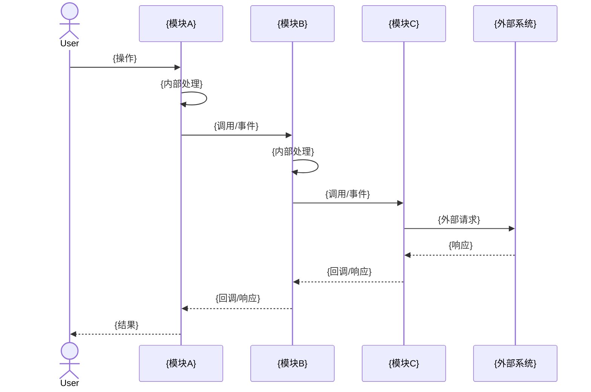

# {场景} 模块交互

## 1. 场景描述

{描述该交互场景是什么，涉及哪些模块}

**涉及模块**: [{模块A}](../02-modules/mod-{A}.md), [{模块B}](../02-modules/mod-{B}.md), [{模块C}](../02-modules/mod-{C}.md)

---

## 2. 交互时序图



---

## 3. 调用链详情

| 序号 | 调用方 | 被调用方 | 方式 | 契约 | 代码位置 |
|------|--------|----------|------|------|----------|
| 1 | {模块A} | {模块B} | {同步/异步} | {请求/响应} | `{Class.method()}` |
| 2 | {模块B} | {模块C} | {同步/异步} | {请求/响应} | `{Class.method()}` |

---

## 4. 数据契约

### 4.1 {模块A} → {模块B}

```json
{
  "field1": "类型/说明",
  "field2": "类型/说明"
}
```

### 4.2 {模块B} → {模块C}

```json
{
  "field3": "类型/说明",
  "field4": "类型/说明"
}
```

---

## 5. 错误处理

| 错误场景 | 处理模块 | 处理方式 | 回滚策略 |
|----------|----------|----------|----------|
| {错误1} | {模块} | {补偿/重试/忽略} | {回滚操作} |
| {错误2} | {模块} | {补偿/重试/忽略} | {回滚操作} |

---

## 6. 一致性保证

- **分布式事务**: {方案，如Saga/TCC/本地消息表}
- **最终一致性**: {如何保障}
- **幂等性**: {如何防止重复处理}

---

## 7. 可检索关键词

`{模块名}` / `{交互名}` / `{契约类}` / `{补偿方法}` / `{分布式事务}`

---

## 8. 导航

- ↑ 上级: [深度主题索引](00-index.md)
- ← 相关: [{模块A}](../02-modules/mod-{A}.md)
