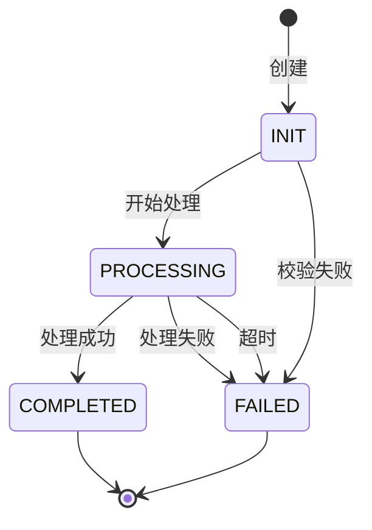

# {实体} 生命周期

## 1. 状态定义

### 1.1 状态枚举

代码位置: `{StatusEnum.java}`

| 状态码 | 状态名 | 含义 | 颜色 |
|--------|--------|------|------|
| 0 | `{INIT}` | 初始 | 🟡 |
| 1 | `{PROCESSING}` | 处理中 | 🔵 |
| 2 | `{COMPLETED}` | 完成 | 🟢 |
| 3 | `{FAILED}` | 失败 | 🔴 |

### 1.2 状态机图

---

## 2. 状态转换详情

### 2.1 {INIT} → {PROCESSING}

- **触发条件**: {描述}
- **触发代码**: `{ClassName.methodName()}` (`{路径}:{行号}`)
- **业务逻辑**: {简述}
- **副作用**: {产生的其他影响}

### 2.2 {PROCESSING} → {COMPLETED}

- **触发条件**: {描述}
- **触发代码**: `{ClassName.methodName()}` (`{路径}:{行号}`)
- **业务逻辑**: {简述}
- **副作用**: {产生的其他影响}

### 2.3 {PROCESSING} → {FAILED}

- **触发条件**: {描述}
- **触发代码**: `{ClassName.methodName()}` (`{路径}:{行号}`)
- **业务逻辑**: {简述}
- **副作用**: {产生的其他影响}

---

## 3. 生命周期钩子

| 时机 | 回调方法 | 代码位置 | 用途 |
|------|----------|----------|------|
| 创建时 | `onCreate()` | `{Class}` | {用途} |
| 状态变更时 | `onStatusChange()` | `{Class}` | {用途} |
| 完成时 | `onComplete()` | `{Class}` | {用途} |

---

## 4. 超时与重试

| 状态 | 超时时间 | 重试策略 | 代码 |
|------|----------|----------|------|
| {PROCESSING} | 30分钟 | 最多3次 | `{Class}` |

---

## 5. 数据一致性

- **状态持久化**: {如何确保状态落库}
- **并发控制**: {乐观锁/悲观锁实现}
- **幂等性**: {如何保证重复处理安全}

---

## 6. 可检索关键词

`{状态名}` / `{状态码}` / `{转换方法}` / `{状态机}` / `{超时}`

---

## 7. 导航

- ↑ 上级: [深度主题索引](00-index.md)
- ← 相关: [{模块}](../02-modules/mod-{模块}.md)
