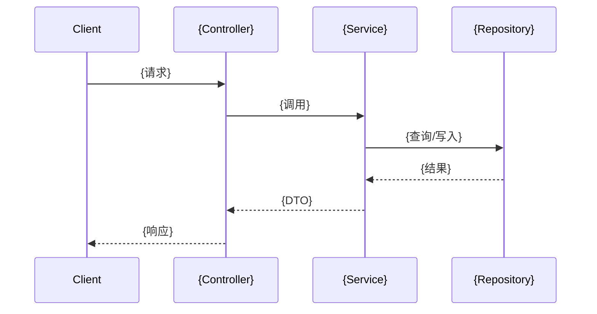

# {模块名称} 模块

> 一句话定位: {描述该模块解决什么问题}

---

## 0. 模块目标

{描述该模块的核心目标和业务价值}

---

## 1. 边界

### 1.1 包含 (In Scope)

- {能力1}
- {能力2}

### 1.2 不包含 (Out of Scope)

- {不属于本模块，由其他模块负责}

### 1.3 上下游关系

- **上游**: [{模块X}](mod-{X}.md) - {调用方式}
- **下游**: [{模块Y}](mod-{Y}.md) - {调用方式}

---

## 2. 可检索关键词

`{关键词1}` / `{关键词2}` / `{ClassName}` / `{table_name}` / `/api/{path}` / `{外部系统}`

---

## 3. 已实现能力 (DONE)

### 3.1 {能力A}

- **描述**: {一句话}
- **入口**: `{ClassName.methodName()}` (`{文件路径}:{行号}`)
- **API**: `{METHOD} /api/{path}`
- **关键实现**:
  - `{ClassA}` - {职责}
  - `{ClassB}` - {职责}

### 3.2 {能力B}

- **描述**: {一句话}
- **入口**: `{ClassName.methodName()}` (`{文件路径}:{行号}`)
- **关键实现**:
  - `{ClassC}` - {职责}

---

## 4. 主要入口与关键类

| 类型 | 名称 | 路径 | 说明 |
|------|------|------|------|
| Controller | `{XxxController}` | `{controller/XxxController.java}` | {职责} |
| Service | `{XxxService}` | `{service/XxxService.java}` | {职责} |
| Repository | `{XxxRepository}` | `{repository/XxxRepository.java}` | {职责} |
| Entity | `{Xxx}` | `{domain/Xxx.java}` | {主实体} |

---

## 5. 核心流程概要

> 详细流程见 [深度层文档](../03-deep/{模块名}/)

### 5.1 {流程A}

{5-10步高层流程描述，不展开细节}

**↓ 详细流程**: [flow-{流程A}](../03-deep/{模块名}/flow-{流程A}.md)

---

## 6. 外部依赖

| 依赖 | 类型 | 用途 |
|------|------|------|
| {MySQL} | 数据库 | 主数据存储，表: `{t_xxx}` |
| {Redis} | 缓存 | 缓存: `{cache_key}` |
| {Kafka} | 消息 | Topic: `{topic_name}` |
| {外部API} | HTTP | {用途} |

---

## 7. 模块协作点

### 7.1 本模块触发其他模块

| 触发点 | 目标模块 | 方式 | 数据 |
|--------|----------|------|------|
| {事件A} | [{模块X}](mod-{X}.md) | {事件/调用} | {数据内容} |

### 7.2 其他模块触发本模块

| 触发点 | 来源模块 | 方式 | 数据 |
|--------|----------|------|------|
| {事件B} | [{模块Y}](mod-{Y}.md) | {事件/调用} | {数据内容} |

---

## 8. 深度文档树

> 以下文档从本模块生长，深入业务细节

| 类型 | 主题 | 文档 | 说明 |
|------|------|------|------|
| 业务流程 | {流程A} | [flow-{流程A}](../03-deep/{模块名}/flow-{流程A}.md) | {一句话说明} |
| 业务流程 | {流程B} | [flow-{流程B}](../03-deep/{模块名}/flow-{流程B}.md) | {一句话说明} |
| 生命周期 | {实体A} | [lifecycle-{实体A}](../03-deep/{模块名}/lifecycle-{实体A}.md) | {一句话说明} |
| 数据流 | {场景A} | [dataflow-{场景A}](../03-deep/{模块名}/dataflow-{场景A}.md) | {一句话说明} |
| 模块交互 | {协作A} | [interaction-{协作A}](../03-deep/{模块名}/interaction-{协作A}.md) | {一句话说明} |

---

## 9. 常见问题

### Q1: {问题1}?

**优先看哪里**: `{ClassName}` (`{路径}`)

**原因**: {简述}

### Q2: {问题2}?

**优先看哪里**: `{ClassName}` (`{路径}`)

**原因**: {简述}

---

## 10. 导航

- ↑ 上级: [模块清单](00-index.md)
- ← 相关: [{相关模块}](mod-{相关}.md)
- ↓ 深入: [深度文档树](../03-deep/{模块名}/)
