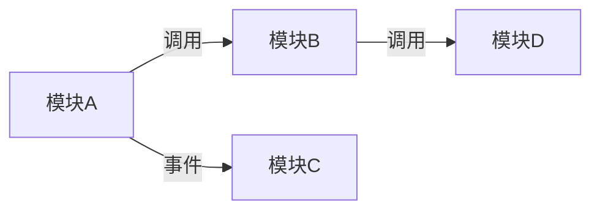

# 模块清单

> 本项目按业务领域划分为以下模块，点击模块名查看详情。

---

## 模块概览

| 模块 | 职责 | 状态 | 文档 |
|------|------|------|------|
| {模块A} | {一句话职责} | {活跃/维护中} | [mod-{A}.md](mod-{A}.md) |
| {模块B} | {一句话职责} | {活跃/维护中} | [mod-{B}.md](mod-{B}.md) |

---

## 模块依赖图

---

## 按场景查找

| 场景 | 相关模块 |
|------|----------|
| {场景1} | [{模块A}](mod-{A}.md) |
| {场景2} | [{模块B}](mod-{B}.md) |

---

## 导航

- ↑ 上级: [系统总览](../01-system/00-index.md)
- → 各模块: 见上表
