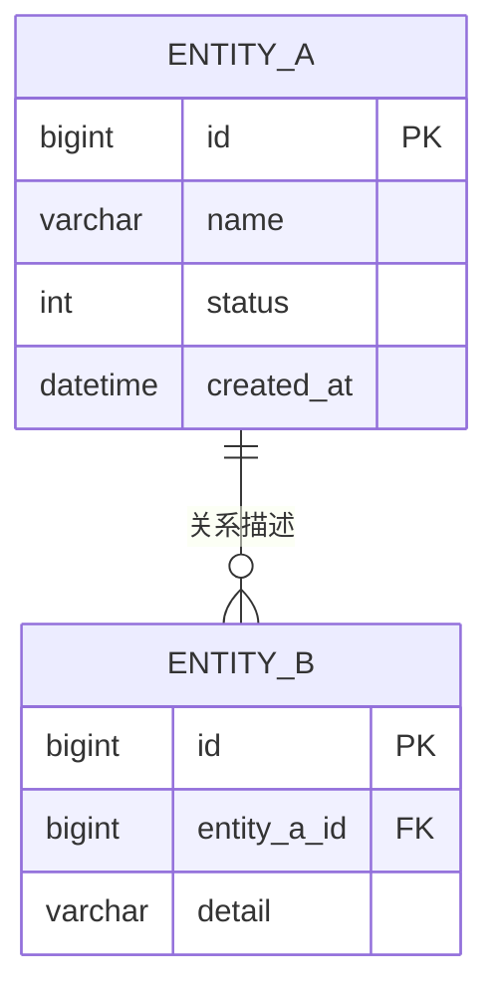

# 核心数据模型

> 仅记录最核心的 5-10 个实体，详细字段在各模块文档中。

---

## 1. 实体关系图

---

## 2. 核心实体

### 2.1 {实体A}

| 属性 | 说明 | 代码 |
|------|------|------|
| 表名 | {t_entity_a} | - |
| 实体类 | {EntityA} | `{EntityA.java}` |
| 主要字段 | id, name, status | - |
| 状态枚举 | {EntityAStatus} | `{EntityAStatus.java}` |

### 2.2 {实体B}

| 属性 | 说明 | 代码 |
|------|------|------|
| 表名 | {t_entity_b} | - |
| 实体类 | {EntityB} | `{EntityB.java}` |
| 主要字段 | id, entity_a_id, detail | - |

---

## 3. 关键枚举

| 枚举 | 用途 | 代码 |
|------|------|------|
| {StatusEnum} | {状态定义} | `{StatusEnum.java}` |
| {TypeEnum} | {类型定义} | `{TypeEnum.java}` |

---

## 4. 可检索关键词

`{表名}` / `{实体名}` / `{字段名}` / `{枚举名}`

---

## 5. 导航

- ↑ 上级: [系统总览](00-index.md)
- ← 相关: [技术栈](03-tech-stack.md)
- → 相关: [全局约定](05-conventions.md)
- ↓ 深入: [模块层索引](../02-modules/00-index.md)
