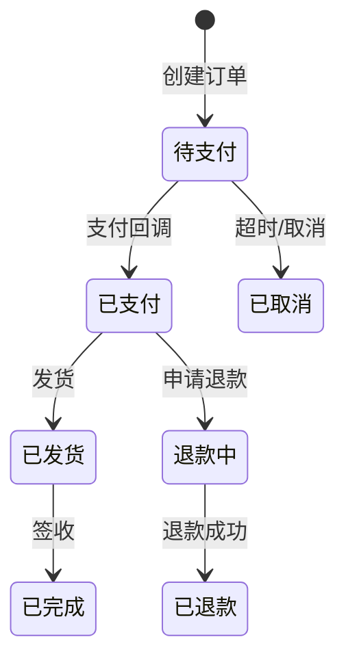
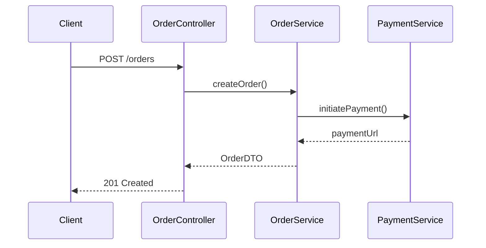
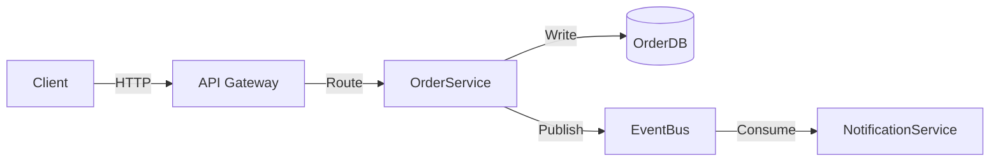

# Agent Memory Skill - Reference

详细的文档编写规范和格式要求。由 [SKILL.md](SKILL.md) 引用，写模式时按需查阅。

---

## 1. 证据锚点格式

每条能力记录必须附带以下格式之一的证据锚点：

| 类型 | 格式示例 |
|------|----------|
| 类 | `OrderService` (`src/service/OrderService.java`) |
| 方法 | `OrderService.createOrder()` |
| 路由 | `POST /api/v1/orders` |
| 配置 | `application.yml:order.max-items` |
| 数据库 | `t_order` 表 |
| 消息 | `ORDER_CREATED` Topic |

---

## 2. 文档通用格式

每个文档应遵循以下结构：

```markdown
# 文档标题

> 一句话定位/摘要

## 1. 章节名

### 1.1 子章节

- **关键词**: 值（证据锚点）
- **关键词**: 值（证据锚点）

## N. 可检索关键词

`关键词1` / `关键词2` / `ClassName` / `/api/path` / `table_name`

## N+1. 导航

- ↑ 上级: [系统总览](00-index.md)
- → 相关: [模块-XX](mod-xx.md)
- ↓ 深入: [数据流-XX](../03-deep/xx/dataflow-xx.md)
```

---

## 3. 正反示例

**❌ Bad** — 无锚点、模糊：
```markdown
## 已实现能力

- 实现了订单管理功能
- 支持多种支付方式
- 有完善的错误处理
```

**✅ Good** — 有锚点、具体：
```markdown
## 已实现能力

- **订单创建**: `OrderService.create()` (`src/service/OrderService.java:45`)
  - 商品校验: `ProductValidator.validate()`
  - 库存扣减: `InventoryService.deduct()`

- **支付集成**: `PaymentController` (`src/controller/PaymentController.java`)
  - 支付宝: `POST /api/payment/alipay`
  - 微信: `POST /api/payment/wechat`

- **错误码体系**: `ErrorCode` 枚举 (`src/constant/ErrorCode.java`)
  - `ORDER_NOT_FOUND` (1001)
  - `PAYMENT_FAILED` (2001)
```

---

## 4. Mermaid 图表规范

深度层使用 Mermaid 图表达复杂逻辑，优先于纯文字描述。

### 状态机图 (生命周期)



### 序列图 (模块交互)



### 数据流图



---

## 5. 更新判断表

| 场景 | 是否更新 | 原因 |
|------|----------|------|
| 正在开发 feature | ❌ | WIP 代码可能变更 |
| PR 评审中 | ❌ | 可能修改或拒绝 |
| 已合并到 main | ❌ | 可能未发布 |
| **已发布到生产** | **✅** | 成为事实标准 |
| 紧急回滚后 | ✅ | 需同步回退文档 |

---

## 6. 记忆文档定位

| 用途 | 正确位置 | 错误位置 |
|------|----------|----------|
| 开发中的需求 | 需求文档/TODO/Comments | ❌ `.agent-memory/` |
| 技术方案讨论 | RFC/设计文档/PR描述 | ❌ `.agent-memory/` |
| 已上线的实现 | ✅ `.agent-memory/` | — |
| 历史变更记录 | Git历史/CHANGELOG | ❌ `.agent-memory/` |

---

## 7. 各层约束详细

### System layer (01-system/)

- 总计 ≤ 500 行
- 只记录稳定、不易变的信息
- 核心数据实体控制在 5-10 个
- 禁止：具体接口列表、字段详情

### Module layer (02-modules/)

- 每篇 ≤ 300 行
- 按业务领域划分（非技术分层）
- 入口类/方法 3-15 个
- 核心流程 5-10 步概要
- 禁止：长篇代码示例，用类名/方法名代替

### Deep layer (03-deep/)

- 按模块创建子目录: `03-deep/{模块名}/`
- 文档类型：`flow-*`、`lifecycle-*`、`dataflow-*`、`interaction-*`
- 使用 Mermaid 图优先于文字描述
- 代码执行链精确到类名+方法名，不展示代码内容
- 禁止：直接贴原始代码

---

## 8. 模板文件索引

| 模板文件 | 生成目标 |
|----------|----------|
| `assets/system-index-template.md` | `01-system/00-index.md` |
| `assets/system-context-template.md` | `01-system/01-context.md` |
| `assets/system-architecture-template.md` | `01-system/02-architecture.md` |
| `assets/system-tech-stack-template.md` | `01-system/03-tech-stack.md` |
| `assets/system-data-model-template.md` | `01-system/04-data-model.md` |
| `assets/system-conventions-template.md` | `01-system/05-conventions.md` |
| `assets/modules-index-template.md` | `02-modules/00-index.md` |
| `assets/module-template.md` | `02-modules/mod-{领域}.md` |
| `assets/deep-index-template.md` | `03-deep/00-index.md` |
| `assets/deep-flow-template.md` | `03-deep/{模块}/flow-{流程}.md` |
| `assets/deep-lifecycle-template.md` | `03-deep/{模块}/lifecycle-{实体}.md` |
| `assets/deep-dataflow-template.md` | `03-deep/{模块}/dataflow-{场景}.md` |
| `assets/deep-interaction-template.md` | `03-deep/{模块}/interaction-{协作}.md` |
