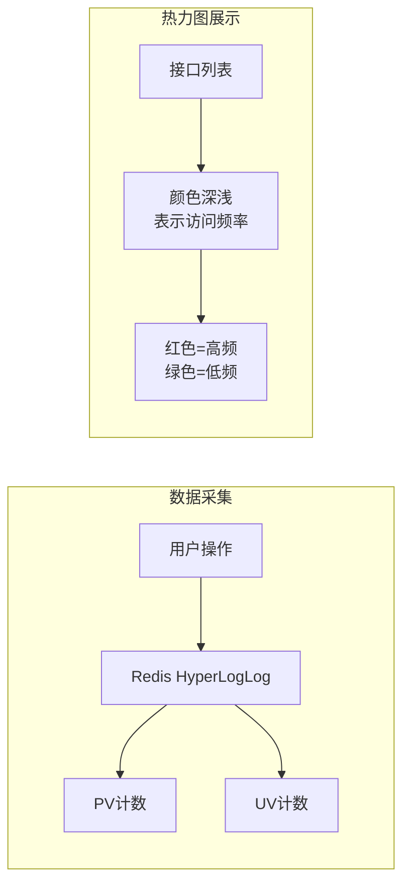

# 操作热力图统计 产品需求文档

**文档类型**：产品需求文档
**适用对象**：业务人员、产品、运营

| 版本号 | 更新时间 | 备注 |
|--------|----------|------|
| v1.0 | 2026-02-27 | 初版 |

---

## 〇、先看懂这张图



**一句话**：统计各接口的访问热度（PV/UV），用热力图直观展示系统操作分布。

---

## 一、这是什么

基于 Redis HyperLogLog 实现的操作热度统计。无侵入地采集接口访问数据，支持实时计算 PV（总访问量）和 UV（独立用户数）。

| 场景 | 作用 |
|------|------|
| 发现热点接口 | 识别系统中最频繁调用的功能 |
| 容量规划 | 根据访问热度分配服务器资源 |
| 优化优先级 | 优先优化高频接口的响应时间 |

**术语**：PV = Page View，总访问次数；UV = Unique Visitor，独立用户数（去重）。

---

## 二、典型场景

### 场景1：发现系统热点

```
运营人员：查看本周操作热力图
         ↓
发现：/order/query 接口占 60% 流量，/report/export 占 5%
         ↓
决策：优先优化查询接口的缓存策略
```

### 场景2：监控新功能使用情况

```
产品发布：新功能上线
         ↓
观察：热力图中新接口颜色从绿变黄再变红
         ↓
结论：用户逐渐接受新功能
```

### 场景3：异常流量识别

```
监控发现：某低频接口突然变红
         ↓
排查：发现有人在批量调用
         ↓
处理：及时限流或封禁
```

---

## 三、怎么用

**开启方式**：在 `@OperationLog` 上启用统计

```java
@OperationLog(heatMap = true)
@GetMapping("/list")
public List<Order> list() {
    // 业务代码
}
```

**查看数据**：通过 actuator 端点或自定义接口获取

```
GET /actuator/operation-log/heat-map

返回：
{
  "/order/list": { "pv": 15000, "uv": 1200 },
  "/order/submit": { "pv": 800, "uv": 600 }
}
```

**热力图可视化**：
- 支持导出数据到 Grafana / Kibana
- 内置简单 HTML 热力图页面

---

## 四、关键规则

### 规则1：统计维度

- 默认按 **接口方法** 维度统计
- 支持按 **业务类型** 聚合（如所有订单相关接口归为一类）
- 支持按 **时间段** 查看（小时/天/周）

### 规则2：时间窗口

| 窗口类型 | 用途 |
|----------|------|
| 实时（1分钟） | 监控当前流量 |
| 小时 | 分析日内分布 |
| 天 | 长期趋势分析 |
| 周 | 周期性规律 |

### 规则3：Redis 数据结构

```
# PV 计数（String，incr）
operation-log:heatmap:pv:{date}:{class}:{method}

# UV 计数（HyperLogLog，pfadd/pfcount）
operation-log:heatmap:uv:{date}:{class}:{method}
```

HyperLogLog 特点：占用固定 12KB，可统计 2^64 个元素，误差约 0.81%。

### 规则4：数据保留

- 实时数据：保留 24 小时
- 小时数据：保留 7 天
- 天数据：保留 90 天
- 自动清理过期数据

---

## 五、最终预期标准

- [ ] 启用统计的接口，PV/UV 自动计入 Redis
- [ ] 可通过接口查询各接口的实时/历史热度
- [ ] 支持导出数据到外部可视化系统
- [ ] Redis 内存占用可控（HyperLogLog 固定 12KB/Key）
- [ ] 统计功能对业务接口性能影响 < 1ms
