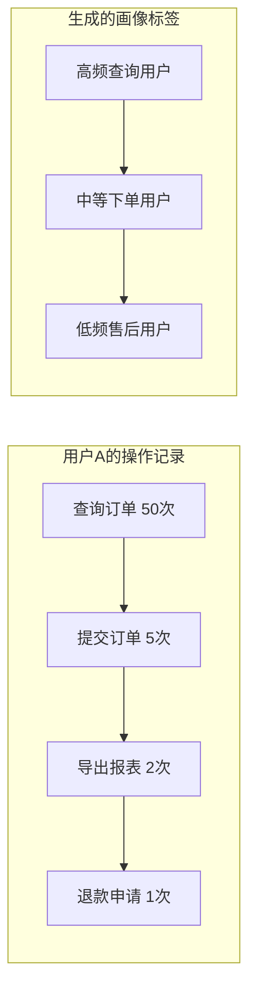

# 用户行为画像 产品需求文档

**文档类型**：产品需求文档
**适用对象**：业务人员、产品、运营

| 版本号 | 更新时间 | 备注 |
|--------|----------|------|
| v1.0 | 2026-02-27 | 初版 |

---

## 〇、先看懂这张图



**一句话**：基于用户操作历史，自动打上行为标签，辅助精细化运营。

---

## 一、这是什么

基于 Redis 聚合用户操作类型分布，自动生成用户行为标签。标签可用于用户分群、个性化推荐、风控识别等场景。

| 场景 | 作用 |
|------|------|
| 用户分群运营 | 识别"高频查询但不下单"用户，定向营销 |
| 风控识别 | 标记"异常操作模式"用户 |
| 产品优化 | 分析不同标签用户的功能使用差异 |

**术语**：行为标签 = 描述用户操作特征的标识（如"高频查询用户"）；操作类型 = 通过 `@OperationLog.type()` 定义的业务类型。

---

## 二、典型场景

### 场景1：识别"只看不买"用户

```
用户画像：查询订单 100次，提交订单 0次
         ↓
标签：高频查询用户、潜在流失风险
         ↓
运营动作：推送优惠券刺激下单
```

### 场景2：识别"VIP高频买家"

```
用户画像：查询 20次，提交 15次，导出 10次
         ↓
标签：高价值用户、报表重度使用者
         ↓
运营动作：提供专属客服、报表定制服务
```

### 场景3：识别"异常操作"用户

```
用户画像：退款申请 20次，下单 5次
         ↓
标签：高频退款用户、疑似羊毛党
         ↓
风控动作：限制参与活动、人工审核
```

---

## 三、怎么用

**定义操作类型**：

```java
@OperationLog(type = "ORDER_QUERY")  // 查询类
@GetMapping("/list")
public List<Order> list() { }

@OperationLog(type = "ORDER_SUBMIT") // 交易类
@PostMapping("/submit")
public Result submit() { }

@OperationLog(type = "ORDER_REFUND") // 售后类
@PostMapping("/refund")
public Result refund() { }
```

**查看用户画像**：

```
GET /actuator/operation-log/user-profile/{userId}

返回：
{
  "userId": 10086,
  "tags": ["高频查询用户", "中等下单用户"],
  "operationStats": {
    "ORDER_QUERY": 150,
    "ORDER_SUBMIT": 8,
    "ORDER_REFUND": 1
  },
  "last7Days": { ... }
}
```

---

## 四、关键规则

### 规则1：标签生成规则（可配置）

```yaml
operation-log:
  user-profile:
    tags:
      - name: "高频查询用户"
        condition: "ORDER_QUERY > 50"
      - name: "高价值用户"
        condition: "ORDER_SUBMIT > 10 AND ORDER_REFUND < 2"
      - name: "潜在流失用户"
        condition: "ORDER_QUERY > 30 AND ORDER_SUBMIT = 0"
```

### 规则2：统计时间范围

- 默认统计 **最近 30 天**
- 支持查看 **7 天/30 天/90 天** 维度
- 每日自动更新标签

### 规则3：Redis 数据结构

```
# 用户操作计数（Hash）
operation-log:user-profile:{userId}:counts
  field: ORDER_QUERY, value: 150
  field: ORDER_SUBMIT, value: 8

# 用户标签（Set）
operation-log:user-profile:{userId}:tags
  value: 高频查询用户
  value: 中等下单用户

# 标签用户索引（Set，反向查询）
operation-log:tag-index:高频查询用户
  value: userId1, userId2, ...
```

### 规则4：标签更新时机

- 实时：每次操作后异步更新计数
- 定时：每日凌晨批量重新计算标签

---

## 五、最终预期标准

- [ ] 用户操作自动按类型聚合统计
- [ ] 根据规则自动生成用户标签
- [ ] 支持按标签查询用户列表
- [ ] 支持查看单个用户的操作分布
- [ ] 标签规则可配置，无需改代码
- [ ] 统计延迟 < 5 分钟
