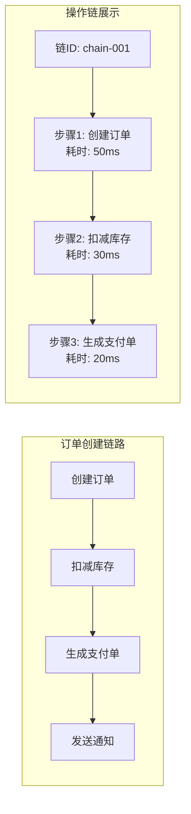

# 操作链追踪 产品需求文档

**文档类型**：产品需求文档
**适用对象**：业务人员、产品、运营

| 版本号 | 更新时间 | 备注 |
|--------|----------|------|
| v1.0 | 2026-02-27 | 初版 |

---

## 〇、先看懂这张图



**一句话**：将同一业务流程的多个操作关联起来，形成完整的操作链路，便于问题排查和性能分析。

---

## 一、这是什么

利用 Redis 缓存关联同一业务流程的多步操作，记录操作顺序、耗时、执行结果，形成可追溯的操作链。

| 场景 | 作用 |
|------|------|
| 问题定位 | 订单异常时查看完整操作链路 |
| 性能分析 | 识别链路中的慢节点 |
| 审计追溯 | 查看业务数据的完整变更历史 |

**术语**：操作链 = 同一业务流程的多个有序操作；链ID = 唯一标识一次业务流程的ID；Span = 单个操作节点。

---

## 二、典型场景

### 场景1：订单创建链路追踪

```
业务流程：创建订单 → 扣库存 → 生成支付单 → 发送通知
         ↓
操作链记录：
  [1] 创建订单 - 成功 - 50ms
  [2] 扣减库存 - 成功 - 30ms
  [3] 生成支付单 - 成功 - 20ms
  [4] 发送通知 - 失败 - 100ms
         ↓
问题定位：通知环节异常，需排查消息服务
```

### 场景2：审批流程追踪

```
业务流程：提交申请 → 主管审批 → 经理审批 → 归档
         ↓
操作链记录：
  [1] 张三提交申请 - 2024-01-15 10:00
  [2] 李四主管审批通过 - 2024-01-15 11:30
  [3] 王五经理审批驳回 - 2024-01-15 14:00
         ↓
结论：申请在经理环节被驳回
```

### 场景3：性能瓶颈识别

```
操作链统计：
  创建订单平均耗时: 50ms
  扣减库存平均耗时: 200ms ← 明显偏慢
  生成支付单平均耗时: 20ms
         ↓
优化方向：优化库存扣减逻辑
```

---

## 三、怎么用

**开启方式**：在业务入口方法上定义链

```java
@OperationLog(chain = "ORDER_CREATE", chainIdExpression = "#dto.orderNo")
@PostMapping("/create")
public Result create(@RequestBody OrderDTO dto) {
    // 1. 创建订单
    // 2. 扣减库存
    // 3. 生成支付单
    return Result.ok();
}

// 子操作自动关联到同一链
@OperationLog(chain = "ORDER_CREATE", chainIdExpression = "#orderNo")
@PostMapping("/deduct-stock")
public Result deductStock(@RequestParam String orderNo) {
    // 扣减库存
}
```

**查看操作链**：

```
GET /actuator/operation-log/chain/{chainId}

返回：
{
  "chainId": "ORDER-20240115-001",
  "chainType": "ORDER_CREATE",
  "startTime": "2024-01-15T10:00:00",
  "endTime": "2024-01-15T10:00:05",
  "totalDuration": 5000,
  "spans": [
    { "step": 1, "operation": "创建订单", "status": "SUCCESS", "duration": 50 },
    { "step": 2, "operation": "扣减库存", "status": "SUCCESS", "duration": 30 },
    { "step": 3, "operation": "生成支付单", "status": "SUCCESS", "duration": 20 }
  ]
}
```

---

## 四、关键规则

### 规则1：链ID生成方式

- 方式1：从参数中提取（如订单号）
- 方式2：从请求头获取（前端传递）
- 方式3：自动生成 UUID

### 规则2：链的传递方式

- 方式1：ThreadLocal（同一线程内的方法调用）
- 方式2：Redis 缓存（跨线程/跨服务）
- 方式3：请求头传递（跨服务调用）

### 规则3：链的生命周期

- 创建：第一个操作执行时
- 更新：每个子操作完成时追加
- 结束：链超时（默认 1 小时）或显式关闭
- 清理：链结束后数据保留 7 天

### 规则4：Redis 数据结构

```
# 链基本信息（Hash）
operation-log:chain:{chainId}:info
  field: type, value: ORDER_CREATE
  field: startTime, value: 2024-01-15T10:00:00
  field: status, value: IN_PROGRESS

# 链操作列表（Sorted Set，按时间排序）
operation-log:chain:{chainId}:spans
  score: 1, value: {span1_json}
  score: 2, value: {span2_json}

# 活跃链索引（Set，用于清理）
operation-log:active-chains
  value: chainId1, chainId2, ...
```

### 规则5：子操作关联

- 自动关联：同一请求线程内的 `@OperationLog` 自动归属当前链
- 手动关联：通过 `OperationLogContext.setChainId()` 显式设置
- 跨服务：通过 HTTP Header `X-Operation-Chain-Id` 传递

---

## 五、最终预期标准

- [ ] 同一业务流程的多操作自动关联
- [ ] 可查看完整操作链及每步耗时
- [ ] 支持跨线程/跨服务的链传递
- [ ] 链数据自动过期清理
- [ ] 支持链的异常中断标记
- [ ] 链查询响应时间 < 100ms
