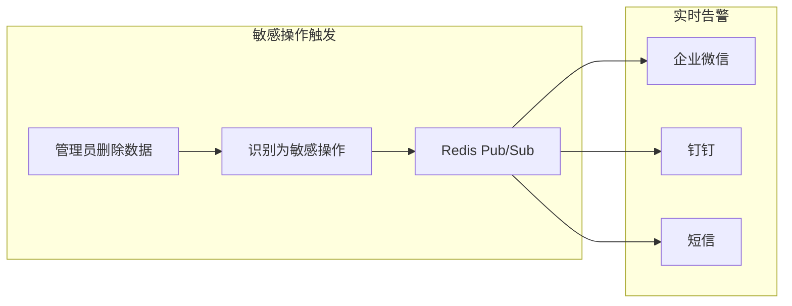

# 敏感操作实时告警 产品需求文档

**文档类型**：产品需求文档
**适用对象**：业务人员、产品、运营、安全

| 版本号 | 更新时间 | 备注 |
|--------|----------|------|
| v1.0 | 2026-02-27 | 初版 |

---

## 〇、先看懂这张图



**一句话**：敏感操作发生时，通过 Redis Pub/Sub 实时推送告警，确保第一时间感知风险。

---

## 一、这是什么

基于 Redis Pub/Sub 的实时告警机制。当标记为敏感的操作被执行时，立即推送消息到配置的告警渠道，支持企业微信、钉钉、短信、邮件等。

| 场景 | 作用 |
|------|------|
| 数据安全 | 核心数据被删除/修改时立即通知 |
| 权限管控 | 管理员操作实时审计 |
| 异常行为 | 非工作时间的高危操作告警 |

**术语**：敏感操作 = 对系统有重大影响的操作（如删除、导出、修改配置）；告警渠道 = 接收告警通知的方式。

---

## 二、典型场景

### 场景1：核心数据删除告警

```
操作发生：管理员删除客户数据
         ↓
系统识别：标记为敏感操作
         ↓
实时推送：企业微信收到告警
         ↓
告警内容："【敏感操作】用户 admin 于 10:00 删除了客户数据，客户ID：12345"
```

### 场景2：非工作时间操作告警

```
操作发生：凌晨3点，管理员导出全量订单
         ↓
系统识别：敏感操作 + 非工作时间
         ↓
实时推送：短信通知安全负责人
         ↓
处理：人工确认是否为异常行为
```

### 场景3：批量操作告警

```
操作发生：用户批量删除100条记录
         ↓
系统识别：敏感操作 + 批量特征
         ↓
实时推送：钉钉群告警
         ↓
告警内容：包含操作人、影响范围、操作时间
```

---

## 三、怎么用

**标记敏感操作**：

```java
@OperationLog(sensitive = true, sensitiveLevel = "HIGH")
@DeleteMapping("/user/{id}")
public Result deleteUser(@PathVariable Long id) {
    // 删除用户
}

@OperationLog(sensitive = true, sensitiveLevel = "MEDIUM")
@PostMapping("/export")
public Result exportData() {
    // 导出数据
}
```

**配置告警渠道**：

```yaml
operation-log:
  alert:
    channels:
      - type: wechat-work
        webhook: https://qyapi.weixin.qq.com/cgi-bin/webhook/...
        level: HIGH
      - type: dingtalk
        webhook: https://oapi.dingtalk.com/robot/...
        level: MEDIUM
      - type: sms
        phone: 13800138000
        level: HIGH
        time-restriction: "00:00-08:00"  # 仅非工作时间
```

**自定义告警内容**：

```java
@Component
public class CustomAlertHandler implements SensitiveAlertHandler {
    @Override
    public void onSensitiveOperation(LogRecord record) {
        // 自定义告警逻辑
    }
}
```

---

## 四、关键规则

### 规则1：敏感级别定义

| 级别 | 说明 | 默认告警渠道 |
|------|------|--------------|
| CRITICAL | 极危险（删库、改配置） | 所有渠道 |
| HIGH | 高危险（删数据、批量操作） | 即时通讯 |
| MEDIUM | 中危险（导出、修改状态） | 钉钉/企微 |
| LOW | 低危险（查询敏感字段） | 日志记录 |

### 规则2：告警去重

- 同一用户同一操作 5 分钟内只告警 1 次
- 批量操作合并为一条告警（含影响数量）
- 可配置告警冷却时间

### 规则3：Redis Pub/Sub 设计

```
# 发布频道
operation-log:alert:sensitive

# 消息格式
{
  "level": "HIGH",
  "operation": "删除用户",
  "userId": 10086,
  "userName": "admin",
  "timestamp": "2024-01-15T10:00:00",
  "details": { ... }
}
```

### 规则4：告警处理器

```java
// 内置处理器
EnterpriseWechatAlertHandler
DingtalkAlertHandler
SmsAlertHandler
EmailAlertHandler

// 自定义处理器实现
public interface SensitiveAlertHandler {
    boolean supports(String level);
    void send(AlertMessage message);
}
```

### 规则5：降级策略

- Redis 不可用：告警写入本地日志，不丢失
- 告警渠道失败：重试 3 次，失败则切换备用渠道
- 消息堆积：超过 1000 条时丢弃低级别告警

---

## 五、最终预期标准

- [ ] 敏感操作触发后 1 秒内推送告警
- [ ] 支持企业微信、钉钉、短信、邮件多渠道
- [ ] 告警内容包含操作人、操作类型、时间、影响范围
- [ ] 支持告警去重和合并
- [ ] Redis 不可用时降级到本地日志
- [ ] 支持自定义告警处理器
