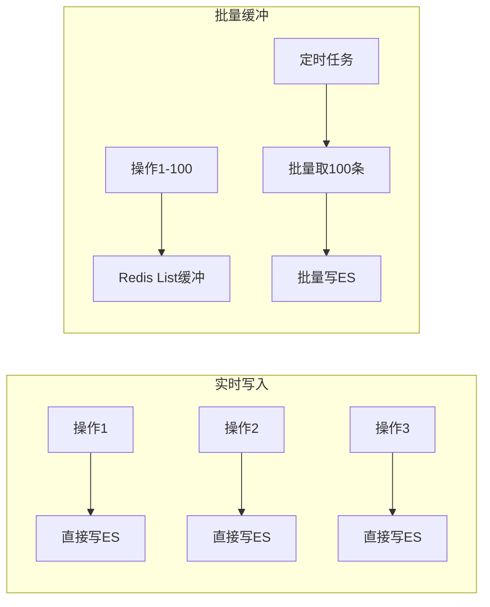

# 日志缓冲批处理 产品需求文档

**文档类型**：产品需求文档
**适用对象**：业务人员、产品、运维

| 版本号 | 更新时间 | 备注 |
|--------|----------|------|
| v1.0 | 2026-02-27 | 初版 |

---

## 〇、先看懂这张图



**一句话**：利用 Redis List 做日志缓冲，批量写入存储，降低 ES/DB 压力，提升系统吞吐量。

---

## 一、这是什么

基于 Redis List 的日志缓冲机制。操作日志先写入 Redis 缓冲队列，定时批量消费写入 Elasticsearch 或数据库，减少存储端压力。

| 场景 | 作用 |
|------|------|
| 高并发写入 | 削峰填谷，平滑写入压力 |
| ES 降本 | 减少 ES 写入次数，降低集群负载 |
| 数据可靠性 | 缓冲层防止日志丢失 |

**术语**：缓冲区 = 临时存储日志的队列；批量大小 = 每次写入的日志数量；刷新间隔 = 定时消费的时间周期。

---

## 二、典型场景

### 场景1：大促期间削峰

```
平时流量：100 QPS，直接写 ES
大促期间：10000 QPS
         ↓
缓冲机制：日志先入 Redis，批量写入
         ↓
结果：ES 写入压力从 10000 降到 100 批次/秒
```

### 场景2：ES 临时不可用

```
ES 状态：网络抖动，写入失败
         ↓
缓冲机制：日志暂存 Redis，不丢失
         ↓
ES 恢复：消费积压日志，补录到 ES
```

### 场景3：批量导入优化

```
场景：批量导入 10万 条数据，产生 10万 条操作日志
         ↓
缓冲机制：每 1000 条批量写入一次
         ↓
结果：ES 写入次数从 10万 降到 100 次
```

---

## 三、怎么用

**开启方式**：配置缓冲策略

```yaml
operation-log:
  buffer:
    enabled: true
    type: redis  # redis / memory
    batch-size: 100
    flush-interval: 5s
    max-buffer-size: 10000
```

**自定义处理器使用缓冲**：

```java
@Component
public class BufferedEsHandler implements OperationLogHandler {
    
    @Autowired
    private LogBuffer buffer;
    
    @Override
    public void handle(LogRecord record) {
        // 入缓冲，不直接写 ES
        buffer.offer(record);
    }
}
```

**监控缓冲状态**：

```
GET /actuator/operation-log/buffer

返回：
{
  "queueSize": 1500,
  "totalBuffered": 50000,
  "totalFlushed": 48000,
  "lastFlushTime": "2024-01-15T10:00:05",
  "avgBatchSize": 95
}
```

---

## 四、关键规则

### 规则1：缓冲策略

| 策略 | 触发条件 | 说明 |
|------|----------|------|
| 数量触发 | 队列达 batch-size | 立即批量写入 |
| 时间触发 | 达 flush-interval | 即使未满也写入 |
| 强制触发 | 应用关闭时 | 刷出剩余日志 |

### 规则2：队列管理

- 单队列：所有日志共用一个 Redis List
- 多队列：按日志类型分队列（如订单/用户/系统）
- 队列满：丢弃新日志或阻塞（可配置）

### 规则3：Redis 数据结构

```
# 缓冲队列（List）
operation-log:buffer:queue
  LPUSH 新日志
  BRPOP 批量消费

# 处理中队列（防止丢失）
operation-log:buffer:processing
  消费时从 buffer 移到 processing
  成功确认后删除
  失败超时后重新入队

# 死信队列（多次失败）
operation-log:buffer:dead-letter
  重试 3 次失败后转入
```

### 规则4：消费者设计

```java
@Component
public class LogBufferConsumer {
    
    @Scheduled(fixedRate = 5000)
    public void flush() {
        List<LogRecord> batch = buffer.pollBatch(100);
        if (!batch.isEmpty()) {
            elasticsearchClient.bulkIndex(batch);
        }
    }
}
```

### 规则5：可靠性保障

- At-Least-Once：处理中队列保证不丢失
- 幂等写入：ES 使用唯一 ID 去重
- 死信处理：人工介入或异步告警

---

## 五、最终预期标准

- [ ] 日志先写入 Redis 缓冲，再批量落盘
- [ ] 支持数量和时间双触发策略
- [ ] 缓冲队列满时有降级策略
- [ ] 消费者故障时日志不丢失
- [ ] 支持多队列隔离不同业务
- [ ] 批量写入性能比单条提升 10 倍以上
