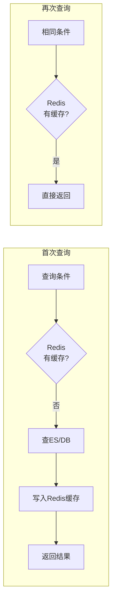

# 操作日志查询缓存 产品需求文档

**文档类型**：产品需求文档
**适用对象**：业务人员、产品、运维

| 版本号 | 更新时间 | 备注 |
|--------|----------|------|
| v1.0 | 2026-02-27 | 初版 |

---

## 〇、先看懂这张图



**一句话**：缓存近期操作日志查询结果，加速审计查询，减轻存储端压力。

---

## 一、这是什么

基于 Redis 的查询结果缓存机制。将频繁执行的查询条件及其结果缓存，下次相同查询直接返回缓存，无需访问 ES/DB。

| 场景 | 作用 |
|------|------|
| 审计查询加速 | 相同查询秒级返回 |
| 减轻 ES 压力 | 热点查询不走 ES |
| 离线查看 | 缓存结果支持离线浏览 |

**术语**：查询指纹 = 查询条件的唯一标识；缓存 TTL = 缓存过期时间；热点查询 = 频繁被执行的查询。

---

## 二、典型场景

### 场景1：审计员重复查询

```
审计员：查询"张三上周的所有操作"
       ↓
第1次：查 ES，耗时 2 秒，结果缓存
       ↓
第2次：查 Redis，耗时 10ms，直接返回
```

### 场景2：报表页面加速

```
报表页：展示"今日操作统计"
       ↓
多人访问：10 个审计员同时打开页面
       ↓
缓存机制：只有第 1 人查 ES，其余读缓存
       ↓
结果：页面加载从 2 秒降到 100ms
```

### 场景3：离线审计

```
场景：网络不稳定，审计员需要离线查看
       ↓
缓存机制：查询结果缓存到 Redis
       ↓
离线时：读取缓存中的结果
```

---

## 三、怎么用

**开启方式**：在查询接口上启用缓存

```java
@OperationLogQueryCache(ttl = 300)  // 缓存 5 分钟
@GetMapping("/logs/search")
public Page<LogRecord> search(LogQueryDTO query) {
    // 查询逻辑
}
```

**缓存注解说明**：

```java
public @interface OperationLogQueryCache {
    int ttl() default 300;           // 缓存时间（秒）
    int maxResults() default 1000;   // 最大缓存条数
    boolean cacheEmpty() default false; // 是否缓存空结果
}
```

**清除缓存**：

```java
// 手动清除
operationLogCacheManager.evict("user:10086:2024-01-15");

// 按模式清除
operationLogCacheManager.evictPattern("user:10086:*");
```

---

## 四、关键规则

### 规则1：缓存键设计

```
# 查询指纹生成
operation-log:cache:{md5(queryJson)}

# 示例
operation-log:cache:a1b2c3d4e5f6

# 带参数的键
operation-log:cache:userId=10086&startDate=2024-01-01
```

### 规则2：缓存内容

```java
public class CachedQueryResult {
    private String queryFingerprint;  // 查询指纹
    private LogQueryDTO query;        // 原始查询条件
    private Page<LogRecord> result;    // 查询结果
    private long cacheTime;           // 缓存时间
    private int ttl;                  // 过期时间
}
```

### 规则3：缓存策略

| 策略 | 说明 |
|------|------|
| 被动缓存 | 查询后自动缓存 |
| 主动预热 | 定时缓存热点查询 |
| 智能更新 | 数据变更时失效相关缓存 |

### 规则4：Redis 数据结构

```
# 缓存内容（String，JSON）
operation-log:cache:{fingerprint}
value: {缓存结果JSON}
expire: 300秒

# 热点查询索引（Sorted Set）
operation-log:cache:hot-queries
score: 查询次数
value: fingerprint

# 用户查询历史（List）
operation-log:cache:user-history:{userId}
value: fingerprint1, fingerprint2, ...
```

### 规则5：缓存失效

- TTL 过期：自动清理
- 主动失效：数据变更时清除
- 容量淘汰：LRU 淘汰冷数据

---

## 五、最终预期标准

- [ ] 相同查询条件命中缓存，响应时间 < 50ms
- [ ] 缓存自动过期，避免脏数据
- [ ] 支持缓存预热和主动失效
- [ ] 缓存容量可控，LRU 淘汰
- [ ] 热点查询自动识别和优化
- [ ] 缓存命中率 > 60%
