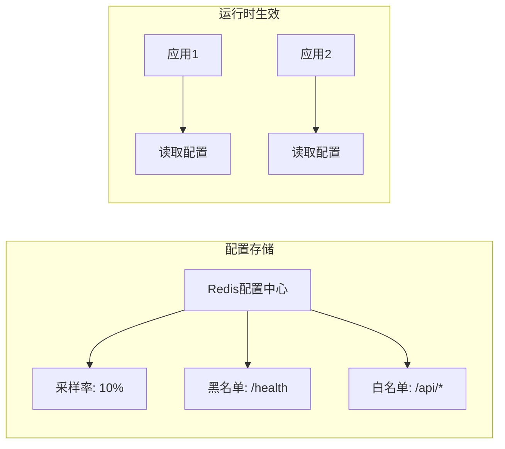

# 动态配置开关 产品需求文档

**文档类型**：产品需求文档
**适用对象**：业务人员、产品、运维

| 版本号 | 更新时间 | 备注 |
|--------|----------|------|
| v1.0 | 2026-02-27 | 初版 |

---

## 〇、先看懂这张图



**一句话**：将日志采集策略存储在 Redis，运行时动态调整，无需重启应用。

---

## 一、这是什么

基于 Redis 的配置中心。采样率、黑白名单、功能开关等配置存储在 Redis，应用实时读取，支持动态调整日志采集策略。

| 场景 | 作用 |
|------|------|
| 大促降本 | 临时降低采样率，减少日志量 |
| 问题排查 | 对特定接口临时开启全量采集 |
| 故障隔离 | 关闭某些接口的日志采集 |

**术语**：采样率 = 记录日志的比例（如 10% 表示每 10 次记录 1 次）；黑白名单 = 控制哪些接口启用/禁用日志。

---

## 二、典型场景

### 场景1：大促期间降本

```
平时配置：采样率 100%，全量记录
         ↓
大促来临：运维修改 Redis 配置
         ↓
新配置：采样率 10%，只记录 10%
         ↓
结果：日志量减少 90%，ES 压力降低
```

### 场景2：问题接口重点监控

```
现象：/payment/callback 接口偶发异常
       ↓
运维操作：将该接口加入白名单，采样率 100%
       ↓
结果：该接口所有调用都被记录，便于排查
```

### 场景3：健康检查接口降噪

```
现象：/health 心跳接口每秒调用 1000 次，产生大量无用日志
       ↓
运维操作：将 /health 加入黑名单
       ↓
结果：健康检查不再记录，日志更干净
```

---

## 三、怎么用

**配置存储格式**：

```yaml
# Redis Key: operation-log:config:global

# 全局采样率（0-100）
sampleRate: 10

# 接口级配置
interfaceConfig:
  "/order/submit":
    sampleRate: 100      # 该接口全量采集
  "/health":
    enabled: false       # 该接口禁用

# 用户级配置
userConfig:
  "10086":
    sampleRate: 100      # VIP用户全量采集

# 功能开关
featureSwitches:
  heatMap: true
  rateLimit: false
  idempotent: true
```

**管理接口**：

```java
@RestController
@RequestMapping("/operation-log/admin")
public class ConfigAdminController {
    
    @PostMapping("/sample-rate")
    public Result setSampleRate(@RequestParam int rate) {
        configManager.setSampleRate(rate);
        return Result.ok();
    }
    
    @PostMapping("/blacklist")
    public Result addToBlacklist(@RequestParam String path) {
        configManager.addToBlacklist(path);
        return Result.ok();
    }
}
```

**配置变更实时推送**：

```
# Redis Pub/Sub 通知所有节点
PUBLISH operation-log:config:changed "global"

# 应用收到通知后刷新本地缓存
```

---

## 四、关键规则

### 规则1：配置优先级

```
1. 接口级配置（最高）
2. 用户级配置
3. 全局配置（最低）
```

### 规则2：配置生效时机

- 主动拉取：每 30 秒检查配置变更
- 被动推送：Pub/Sub 实时通知
- 本地缓存：配置读取后缓存 60 秒

### 规则3：Redis 数据结构

```
# 全局配置（Hash）
operation-log:config:global
  field: sampleRate, value: 10
  field: heatMapEnabled, value: true

# 接口配置（Hash）
operation-log:config:interface:{path}
  field: sampleRate, value: 100
  field: enabled, value: true

# 配置变更通知（Pub/Sub）
channel: operation-log:config:changed
```

### 规则4：配置校验

- 采样率范围：0-100
- 接口路径格式：以 / 开头
- 用户 ID：数字

### 规则5：降级策略

- Redis 不可用：使用本地配置文件
- 配置解析失败：使用上一次有效配置
- 配置不存在：使用默认值

---

## 五、最终预期标准

- [ ] 配置修改后 5 秒内全局生效
- [ ] 支持全局、接口级、用户级三级配置
- [ ] 配置变更通过 Pub/Sub 实时推送
- [ ] Redis 不可用时降级到本地配置
- [ ] 提供管理接口查看和修改配置
- [ ] 配置修改记录审计日志
