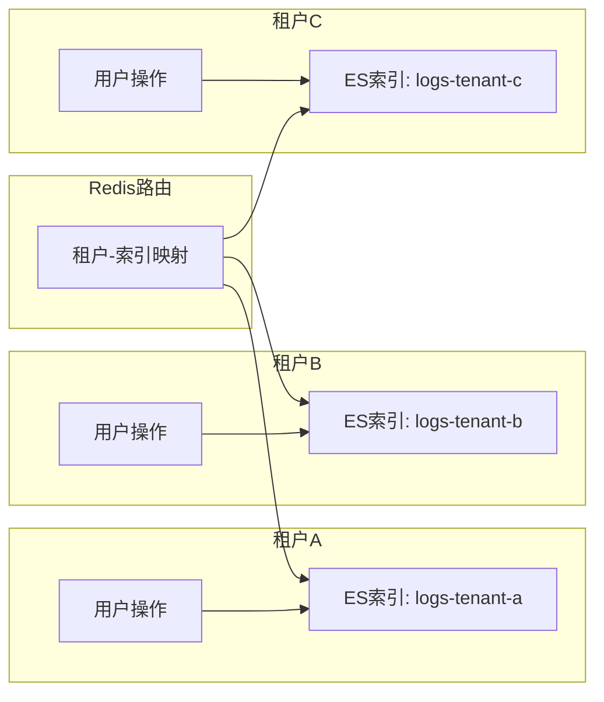

# 多租户日志隔离 产品需求文档

**文档类型**：产品需求文档
**适用对象**：业务人员、产品、运维、架构

| 版本号 | 更新时间 | 备注 |
|--------|----------|------|
| v1.0 | 2026-02-27 | 初版 |

---

## 〇、先看懂这张图



**一句话**：根据租户自动路由日志到不同的 ES 索引/DB 表，实现数据隔离和独立管理。

---

## 一、这是什么

基于 Redis 维护租户-索引映射，自动将不同租户的操作日志路由到独立的存储位置（ES 索引或 DB 表），实现数据隔离、独立生命周期管理。

| 场景 | 作用 |
|------|------|
| SaaS 多租户 | 各租户数据物理隔离 |
| 数据合规 | 不同租户独立设置保留策略 |
| 性能隔离 | 大租户不影响小租户查询 |

**术语**：租户 = 使用系统的独立组织/客户；索引路由 = 根据租户标识选择存储位置；数据隔离 = 租户间数据不可见。

---

## 二、典型场景

### 场景1：SaaS 平台多租户

```
租户A：大型企业，数据量大
租户B：中小客户，数据量小
       ↓
路由策略：
  租户A → ES索引 logs-tenant-a（高配集群）
  租户B → ES索引 logs-tenant-b（标准集群）
       ↓
结果：资源按需分配，互不影响
```

### 场景2：数据合规要求

```
租户A：金融行业，要求保留 7 年
租户B：普通企业，保留 1 年
       ↓
独立索引：各自配置生命周期策略
       ↓
结果：合规要求独立满足
```

### 场景3：大租户性能保障

```
现象：租户A数据量占 80%，查询慢影响其他租户
       ↓
隔离方案：租户A独立索引和集群
       ↓
结果：租户A查询不影响租户B/C
```

---

## 三、怎么用

**开启方式**：配置多租户模式

```yaml
operation-log:
  multi-tenant:
    enabled: true
    tenant-resolver: header  # header / session / custom
    header-name: X-Tenant-Id
```

**自定义租户解析**：

```java
@Component
public class CustomTenantResolver implements TenantResolver {
    @Override
    public String resolveTenantId(HttpServletRequest request) {
        // 从请求中解析租户ID
        return request.getHeader("X-Tenant-Id");
    }
}
```

**配置租户路由**：

```java
@Component
public class TenantIndexRouter implements OperationLogHandler {
    
    @Autowired
    private RedisTemplate redis;
    
    @Override
    public void handle(LogRecord record) {
        String tenantId = TenantContext.getCurrentTenant();
        
        // 从 Redis 获取索引名
        String indexName = redis.opsForHash()
            .get("operation-log:tenant-index", tenantId);
        
        // 路由到对应索引
        elasticsearchClient.index(indexName, record);
    }
}
```

**管理租户路由**：

```
POST /operation-log/admin/tenant
{
  "tenantId": "tenant-a",
  "indexName": "logs-tenant-a",
  "cluster": "cluster-premium",
  "retentionDays": 2555  // 7年
}
```

---

## 四、关键规则

### 规则1：租户识别方式

| 方式 | 说明 | 适用场景 |
|------|------|----------|
| Header | 请求头传递 | API 调用 |
| Session | 会话属性 | Web 应用 |
| Token | JWT 解析 | 微服务 |
| Custom | 自定义逻辑 | 特殊场景 |

### 规则2：索引命名规范

```
默认：operation-log-{tenantId}-{yyyy.MM.dd}
示例：
  operation-log-tenant-a-2024.01.15
  operation-log-tenant-b-2024.01.15
```

### 规则3：Redis 路由映射

```
# 租户-索引映射（Hash）
operation-log:tenant-index
  field: tenant-a, value: logs-tenant-a
  field: tenant-b, value: logs-tenant-b

# 租户-集群映射（Hash）
operation-log:tenant-cluster
  field: tenant-a, value: cluster-premium
  field: tenant-b, value: cluster-standard

# 租户-保留策略（Hash）
operation-log:tenant-retention
  field: tenant-a, value: 2555  // 7年
  field: tenant-b, value: 365   // 1年
```

### 规则4：默认租户处理

- 未识别租户：使用默认索引
- 新租户：自动创建索引映射
- 禁用租户：路由到黑洞（不存储）

### 规则5：查询隔离

```java
@Service
public class LogQueryService {
    
    public Page<LogRecord> search(LogQuery query) {
        String tenantId = TenantContext.getCurrentTenant();
        String indexName = getIndexName(tenantId);
        
        // 强制带租户条件
        query.setTenantId(tenantId);
        
        return elasticsearchClient.search(indexName, query);
    }
}
```

---

## 五、最终预期标准

- [ ] 根据租户自动路由到对应 ES 索引
- [ ] 租户间数据完全隔离，不可互查
- [ ] 支持租户独立配置保留策略
- [ ] 新租户自动初始化索引
- [ ] 支持租户迁移（合并/拆分）
- [ ] 提供租户级查询和统计接口
